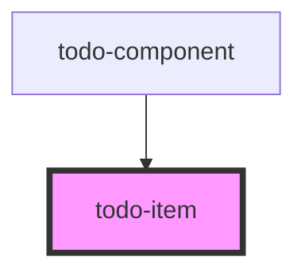

# todo-item

<!-- Auto Generated Below -->

## Properties

| Property | Attribute | Description | Type      | Default     |
| -------- | --------- | ----------- | --------- | ----------- |
| `desc`   | `desc`    |             | `string`  | `undefined` |
| `done`   | `done`    |             | `boolean` | `undefined` |

## Dependencies

### Used by

 - [todo-component](.)

### Graph

----------------------------------------------

*Built with [StencilJS](https://stenciljs.com/)*
